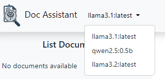

# Document AI Assistant

## Overview

The **Document AI Assistant** is a FastAPI application that enables users to interact with documents using a Large Language Model (LLM). Users can upload documents, query their content, and retrieve insights efficiently, thanks to precomputed embeddings.

---

## Installation Instructions

### Prerequisites

1. Install [Ollama](https://ollama.com/):
   - Ollama is required to manage and run Large Language Models (LLMs).
   - Ensure that at least one LLM is installed and configured through Ollama.

### Steps to Install and Run the Application

1. **Clone the Repository**:
   ```bash
   git clone https://github.com/KamilGrundas/Document-AI-Assistant.git
   cd Document-AI-Assistant
   ```

2. **Install Dependencies**:
   Install all required Python modules:
   ```bash
   pip install -r requirements.txt
   ```

3. **Start the FastAPI Server**:
   Run the application using `uvicorn`:
   ```bash
   uvicorn app.main:app --reload
   ```

   The server will be available at `http://127.0.0.1:8000`.

---

## Features and User Interface

### 1. **Model Selection**
   Users can select from available models to customize how queries are processed. Example UI for model selection:

   

### 2. **Model Query Options**
   Choose specific query settings, single query for all documents or separate query for each document.

   

### 3. **Document Selection**
   Manage your document library, upload new documents, or select specific documents to query.

   

### 4. **Chat**
   Ask model about selected documents.

   

---

## Additional Notes

- Ensure that the Ollama service is running before starting the FastAPI application.
- Visit [Ollama Documentation](https://ollama.com/) for more details about configuring LLMs.
